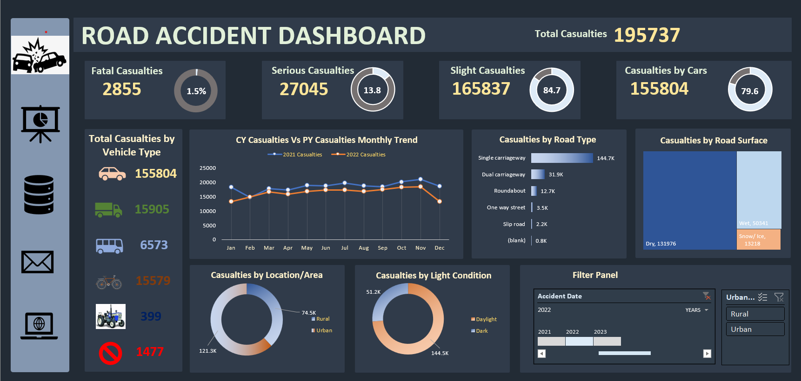

# Road-Accident-Project

# Project Overview
The objective of this project is to clean, process, analyze, and visualize road accident data using Excel to gain valuable insights
and create a user-friendly dashboard. The primary key performance indicators (KPIs) include the total number of casualties after accidents,
the percentage of casualties relative to accident severity, and the type of vehicles with the highest number of casualties.

The secondary KPIs focus on the total casualties categorized by vehicle type, monthly trends comparing casualties between the current year 
and the previous year, the road types with the maximum casualties, the distribution of casualties based on road surface conditions, and the 
relationship between casualties based on the location (area) and time (day/night).

# Aim
This project focuses on analyzing road accident data using Excel to create a comprehensive dashboard for the years 2021 and 2022. 
The dashboard will provide insights into various aspects of road accidents, including casualties, accident severity, vehicle types, monthly trends, 
road types, road surfaces, and the relationship between casualties and location/time.

# Dataset
The dataset used for this analysis is an Excel file containing road accident data for the years 2021 and 2022. The dataset includes information 
such as accident date, accident severity, vehicle types involved, casualties, road type, road surface conditions, and location details.

# Project Components
This project involves the following components:

Data Cleaning: Use Excel's data cleaning functions and tools to handle missing values, outliers, and inconsistencies in the road accident dataset.

Data Processing: Process the cleaned data in Excel by extracting relevant features, calculating required metrics, and transforming the data into a 
format suitable for analysis and visualization.

Data Analysis: Utilize Excel's data analysis features, such as pivot tables, charts, and formulas, to perform exploratory data analysis and 
uncover patterns, trends, and relationships within the road accident data.

Data Visualization: Create visualizations, charts, and graphs using Excel's charting tools to present the analyzed data in an easy-to-understand format.

Report/Dashboard: Develop a comprehensive report or dashboard in Excel that incorporates the analyzed data and provides interactive features for users 
to explore the road accident insights.

# Conclusion
Summarize the key findings and insights obtained from the analysis of the road accident data using Excel. Discuss the implications of these findings 
and how they can contribute to improving road safety measures.

# Challenges
One of the main challenges in creating an Excel dashboard for the Road Accident Project is striking the right balance between data complexity and user-friendliness. You need to ensure that the dashboard provides comprehensive insights while remaining easy to understand and navigate, addressing the needs of both data analysts and non-technical stakeholders.

